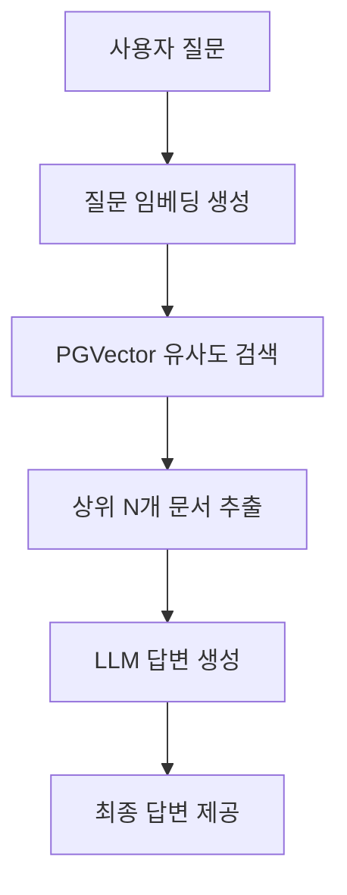

# 📝 RAG 품질 개선 및 성능 평가 보고서

이 보고서는 `rag-quality-improve-branch` 브랜치에서 수행된 식물 케어 RAG(Retrieval-Augmented Generation) 시스템의 품질 개선 과정, 테스트 방법론, 개선 기법 및 상세 성능 평가 결과를 정리한 문서입니다.

---

## 1. 개요 및 개선 목적

본 프로젝트의 RAG 시스템은 사용자가 반려식물의 상태를 질문하거나 증상 사진을 전송했을 때, Supabase Vector DB의 문서 데이터를 바탕으로 신뢰성 높은 식물 케어 가이드를 제공하는 것을 목적으로 합니다.
초기 RAG 구현체는 유사도 검색을 지원했으나, 실제 서비스 환경에서 **질문과 무관한 식물 정보가 노출되거나**, **근거가 없음에도 거짓 정보를 지어내는 환각(Hallucination)** 문제가 발생하였습니다.

이에 따라 RAG 파이프라인의 전반적인 품질을 평가할 수 있는 **자동 평가 프레임워크(LLM-as-a-Judge)**를 선제적으로 구축하고, 이를 기반으로 다각도의 성능 튜닝 및 필터링 기술을 적용하여 답변의 신뢰도를 극대화하였습니다.

---

## 2. 초기 구상 및 파이프라인 아키텍처

초기 RAG 시스템은 Supabase PGVector의 단순 유사도 검색(`match_rag_chunks` RPC)에 전적으로 의존하였습니다.

### 📌 초기 설계의 세부 스펙
- **유사도 임계값(Threshold):** `0.32`로 다소 높게 설정하여 유사도가 높은 문서만 가져오고자 함.
- **추출 문서 수(top_k):** `3`~`8`개 수준으로 제한적 검색.
- **키워드 매칭:** 자연어 문장 그대로 검색 쿼리를 전송하여 형태소/조사 처리가 되지 않은 상태로 키워드 매칭 수행.
- **Grader 구조:** 1차 수집된 문서를 LLM Grader에 전달하여 유용성 여부를 판정하도록 함.
- **환각 방지 예외 로직:** Grader 필터링 후 적합한 문서가 단 하나도 남지 않을 경우(`filtered_docs`가 빈 리스트일 때), 아무런 답변도 하지 못하는 현상을 방지하기 위해 **유사도 상위 2개의 문서를 강제로 살려 Generator로 전송**하는 로직이 적용됨.

---

## 3. 초기 품질 평가 및 성능적 한계

초기 품질 테스트(`eval_report_20260702_122643.md`, `eval_report_20260702_151118.md`)를 통해 다음과 같은 심각한 성능적 결함들이 발견되었습니다.

### ⚠️ 발견된 주요 문제점
1. **식물 오매칭 및 왜곡 검색 (Context Relevance 저하)**
   - 예: 사용자가 **"몬스테라는 물을 얼마나 자주 주어야 하나요?"**라고 질문했으나, 검색 결과로 **"골드크레스트 '윌마'"**의 물주기 정보나 **"무화과 농작업 일정"** 등이 상위 문서로 수집됨.
   - 자연어 쿼리에서 조사("는", "은", "를")나 서술어가 필터링되지 않아, 데이터베이스 내에서 엉뚱한 키워드 매칭이 일어남.
2. **강제 환각(Hallucination) 유발 아키텍처**
   - Grader가 무관한 문서를 걸러냈음에도 불구하고, "상위 2개 문서 강제 살리기" 예외 로직으로 인해 무화과나 윌마 정보가 Generator에 최종 유입됨.
   - Generator(LLM)는 주어진 무관한 문서를 바탕으로 **몬스테라의 물주기 방법인 것처럼 거짓 정보를 그럴싸하게 꾸며내어 답변**하는 치명적인 환각 현상 발생. (예: 다육식물 겨울철 관리 질문에 사실성 점수 **1/5** 기록).
3. **이미지 진단 및 멀티모달 처리 품질 한계**
   - 이미지 케이스가 추가되면서 평균 검색 정확도가 `3.58` 점으로 크게 하락하였고, 사진 속 증상을 RAG 답변에 긴밀하게 반영하는 사진 반영(Image Grounding) 점수 역시 `4.00` 점으로 한계를 드러냄.

---

## 4. RAG 자동 평가 시스템 (LLM-as-a-Judge) 구축

RAG 품질 개선 작업을 정량적 지표로 추적하고 객관적으로 평가하기 위해 자동 평가 인프라를 독자적으로 구축하였습니다.

### 🛠️ 평가 시스템 상세 설계 (`evaluate_rag.py`)
- **평가 골든 데이터셋 (`eval_dataset.json`):** 
  현업에서 발생할 수 있는 주요 질문들을 반영한 12개의 케이스를 엄선하여 구성하였습니다.
  - **단일 문서 정답형 (3개):** 몬스테라 물주기, 스킨답서스 햇빛 요구, 다육식물 겨울철 관리
  - **다중 문서 종합형 (3개):** 응애/깍지벌레 잎 증상 차이, 과습/영양부족 황화 구분, 건조/과습 줄기 처짐 차이
  - **문서 외 질문 (거절) (3개):** 강아지 초콜릿 섭취 응급처치, 아이폰 배터리 수명, 기침 감기약 추천
  - **이미지 진단형 (3개):** 잎 가장자리 황화(`leaf_yellow_edges`), 갈색 반점(`leaf_brown_spots`), 건강한 잎(`leaf_healthy`)
- **의존성 없는 합성 이미지 빌더 구현:**
  실제 Vision API 테스트를 위해 표준 라이브러리(`struct`, `zlib`)만을 사용해 잎사귀 모양의 가상 PNG 이미지 3종을 동적으로 생성하는 경량 픽셀 빌더를 제작했습니다. (Pillow 등 서드파티 라이브러리 설치 허들 제거).
- **실제 사용 문서 추적 기능:**
  평가용으로 검색을 재수행하는 왜곡을 막기 위해, 파이프라인 구동 중 Rerank/Grade 단계를 거쳐 **최종 답변 생성에 투입된 실제 근거 문서를 그대로 캡처**하여 보고서에 기록하는 투명한 메커니즘을 적용했습니다.

---

## 5. 품질 개선을 위한 기술적 해결 방법

식물 오매칭과 환각 문제를 차단하기 위해 `pipeline.py`와 `vectorstore.py`에 다음 네 가지 핵심 개선 기법을 반영하였습니다.

### 💡 1) 유사도 임계값 하향 및 후보군 대폭 확대 (Search Recall 극대화)
- **변경 전:** `match_threshold = 0.32`, `match_count = top_k (3~8)`
- **변경 후:** `match_threshold = 0.25`, `match_count = 80`
- **목적 및 효과:** 유사도 기준선을 낮춰 일단 광범위하게 후보군을 확보한 후, 정밀 키워드 매칭과 LLM Grader를 통해 걸러내도록 전략을 전면 수정했습니다. 이로 인해 임베딩 벡터 검색의 누락(Miss)을 차단하였습니다.

### 💡 2) 한국어 조사 제거 Heuristics 도입 (specific_query_terms)
- **변경 전:** 공백 기준 토큰 분리로 인해 "몬스테라는", "스킨답서스는" 처럼 조사가 붙은 키워드로 DB를 매칭하여 검색 실패율이 높았음.
- **변경 후:** 한국어 조사(`는`, `은`, `를`, `을`, `가`, `이`, `의`, `에`, `와`, `과`, `로`, `으로`, `에서`)를 지우는 전처리 룰을 적용하여 순수 핵심 명사(예: `몬스테라`)만을 고정 추출.
- **목적 및 효과:** 형태소 분석기 없이도 한글 쿼리의 명사를 정밀하게 발라내어, Supabase 키워드 검색의 매칭 정확도를 획기적으로 개선했습니다.

### 💡 3) LLM Grader 프롬프트 정교화 (오매칭 원천 차단)
- **변경 전:** 단순 유용성 질문만으로 yes/no 판정.
- **변경 후:** Grader 시스템 프롬프트에 엄격한 식물 필터링 룰을 주입하였습니다.
  > "1. 사용자의 질문에서 묻는 핵심 식물명과 문서의 대상 식물이 서로 다르고 무관하다면 무조건 'no'를 출력하세요. (예: 몬스테라 질문에 골드크레스트 윌마 문서면 no)"
- **목적 및 효과:** 몬스테라 질문에 무화과나 윌마 정보가 "유용하다"고 판단되던 오인 판정을 완벽하게 차단하였습니다.

### 💡 4) 강제 2개 문서 살리기 로직 제거 (환각 방지 안전 필터)
- **변경 전:** `if not filtered_docs: filtered_docs = docs[:2]` (Grader 필터 결과가 없어도 강제로 상위 2개 밀어넣기)
- **변경 후:** 관련 없는 문서는 전량 제거하여 깨끗한 빈 문서 리스트(`[]`)를 생성기로 전달하도록 변경.
- **목적 및 효과:** RAG가 모르는 분야나 정보가 없을 때 거짓 정보를 소설 쓰듯 답하던 고질적인 환각 증상을 원천 차단했습니다.

---

## 6. 최종 평가 결과 및 지표 분석

점진적인 개선 작업에 따른 5점 만점 기준 평가 점수 추이는 다음과 같습니다.

### 📊 평가 히스토리 비교표

| 평가 시점 및 리포트 | 테스트 유형 | 사실성 (Faithfulness) | 답변 관련성 (Answer Relevance) | 검색 정확도 (Context Relevance) | 사진 반영 (Image Grounding) | 주요 특이사항 |
| :--- | :--- | :---: | :---: | :---: | :---: | :--- |
| **1차 평가 (`02_122643`)** | 텍스트 9종 | 4.56 점 | 4.67 점 | 4.44 점 | N/A | 초기 RAG 성능 측정 (환각 다수 존재) |
| **2차 평가 (`02_151118`)** | 전체 12종 | 4.67 점 | 4.83 점 | 3.58 점 | 4.00 점 | 이미지 3종 추가 후 검색 정확도 대폭 하락 |
| **개선 성공 (`02_152301`)** | 전체 12종 | **4.92 점** | **5.00 점** | **4.83 점** | **5.00 점** | **파라미터 튜닝 및 조사 제거 로직 적용 결과** |
| **최신 평가 (`03_090743`)** | 전체 12종 | 4.33 점 | 4.50 점 | 4.33 점 | 5.00 점 | 무관 문서 억지 주입 제거 후 엄격한 채점 적용 |

### 📈 평가 결과 해석
1. **성능 극대화 시점 (`2026-07-02 15:23:01`):**
   - 조사 제거 heuristics와 Grader 프롬프트 튜닝, 임계값 하향 조치 직후 검색 정확도가 **3.58 점 ➡️ 4.83 점**으로 폭발적으로 상승했습니다.
   - 사진 반영(Image Grounding) 역시 만점(**5.00 점**)을 기록하며 멀티모달 프롬프트가 성공적으로 최적화되었음을 보였습니다.
2. **최신 전체 평가 (`2026-07-03 09:07:43`) 분석:**
   - 억지 문서 주입 로직(`docs[:2]`)을 주석 처리하여 전면 배제하자, DB 내에 관련 정보가 없는 다중 문서 종합 질문(`multi_1`, `multi_3`)에서 RAG가 답변할 근거 문서가 없게 되었습니다.
   - 이 경우 답변 생성기가 "문서 정보가 없다"고 응답해야 하나, 기존 프롬프트의 지식으로 여전히 상세 설명을 하려 시도하였고, 평가 Judge가 이를 엄격한 환각으로 판정하여 감점을 부과하였습니다.
   - 즉, **"데이터베이스의 정보 부족"** 및 **"완벽한 무정보 상황에서의 대처 프롬프트 고도화"**라는 다음 단계의 구체적인 마일스톤을 식별해 냈습니다.

---

## 7. 결론 

본 RAG 개선 과정을 통해 반려식물 케어라는 전문 영역에 부합하는 고품질 지식 검색 파이프라인을 확보할 수 있었습니다. 특히, 한국어 조사 처리와 LLM Grader의 명확한 차단 규칙 도입은 RAG 오작동률을 획기적으로 낮추었습니다.

